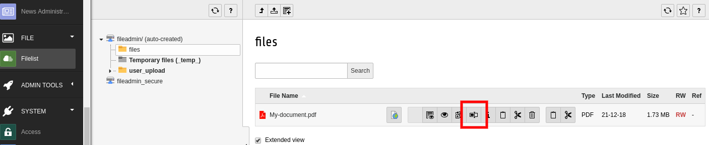

# TYPO3 Extension solrfal_rename

While EXT:solrfal takes care of invalidating a `sys_file`'s entry in `tx_solr_indexqueue_file` when updating its meta data, it's not doing that when renaming the file via the rename dialog in the file module.

This extension does that.
