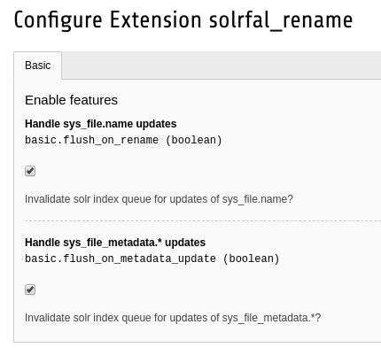

# TYPO3 Extension solrfal_rename

While EXT:solrfal takes care of invalidating a `sys_file`'s entry in `tx_solr_indexqueue_file` when updating its meta data, it's not doing that when renaming the file via the rename dialog in the file module.


This extension does that.

## Installation

### Install via composer

```
composer require kitzberger/solrfal-rename
```

### Set extension settings

Make sure to set at least the checkbox for `flush_on_rename`. The 2nd checkbox for `flush_on_metadata_update` might be necessary to check as well when using only the page context for indexing files.


